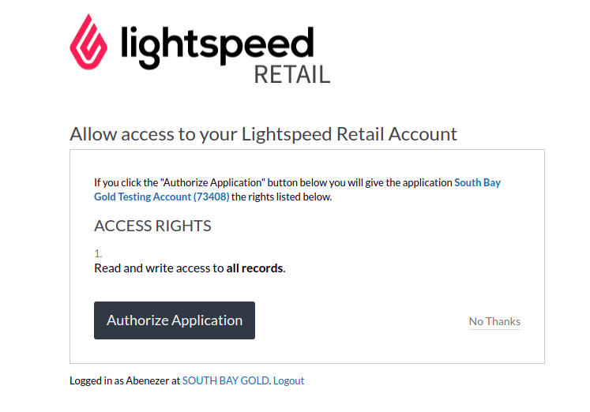

# Lightspeed API Integration Project

## About the project 

* This project is developed, to integrate a backend API with the Lightspeed API

## Getting started 

* These instructions will get you a copy of the project up and running on your local machine for development and testing purposes.

### Installation 

1. Clone the repository 

   ```
   git clone https://github.com/AbegaM/Lightspeed-API-Integration.git
   ```

2. Install the NPM packages 

   ```
   npm install
   ```

### Set up environment variables 

* Create a .env file and add the environment variables in the file, you can check the dotenv.example file
  
  ```
   PORT
   LIGHTSPEED_CLIENT_ID
   LIGHTSPEED_CLIENT_SECRET
  
  ```

### Environment variables description

  ```
   PORT: The port in which your server will run 
   LIGHTSPEED_CLIENT_ID: The client ID which is provided by Lightspeed 
   LIGHTSPEED_CLIENT_SECRET: The client secret value which is provided by Lightspeed
  ```


### Running the code 

1. Run the code in development environment

   ```
   npm run dev
   ```

2. Run the code in production environment 

   ```
   npm run start
   ```

3. After running the code go to your browser and send a request to this address 
  
   ```
    http://localhost:8000/api/auth/signin/lightspeed
   ```
4. You will be redirected to the lightspeed login page, login with your account and click the authorize button

   

5. When you authorize the app, it will send a GET request to the Account API and it will show you your account information like this 
   ```json
    {
      "accountID": "Cv20DD40",
      "name": "Account Name",
      "link": {
        "@attributes": {
          "href": "/API/Account/Cv20DD40"
        }
      }
    }
   ```

## Built with 

1. [NodeJS](https://nodejs.org/en/) 
2. [ExpressJS](https://expressjs.com/)
